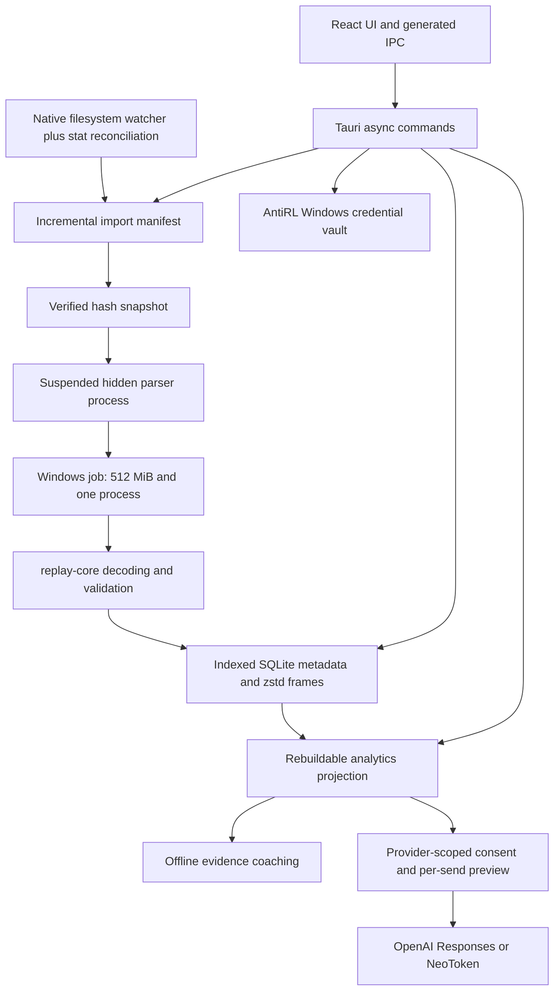

# AntiRL architecture

Updated 2026-10-05. Source schema 5; analytics schema 2.

## Desktop boundary

`commands.rs` contains async commands. SQLite, filesystem and credential operations use `spawn_blocking`; network adapters are async. `dto.rs` defines response contracts and validated practice input. Replay types originate in replay-core. Tauri Specta generates `app/src/bindings.ts` from the actual command registry. Error variants serialize to `{code,message}`; a centralized conversion classifies legacy internal service messages at this boundary. Dynamic research, evidence and analytics documents still use bounded JSON; they are not advertised as fully schema-generated domain models.

The frontend uses generated methods for principal library, settings, identity, playback, message, model, import-status and AI APIs. The dynamic transport retains top-level snake_case compatibility by mapping argument keys to camelCase. Nested domain JSON stays unchanged. The exporter removes an opaque generated Channel alias so the actual Tauri JS Channel type remains authoritative; generation and drift checks cover this normalization.

Production CSP allows local scripts without `unsafe-inline` or `unsafe-eval`, local fonts, and local IPC connections. Inline styles remain allowed for React/Babylon layout. The webview has no direct cloud endpoint permission; Rust makes consented provider requests. External links go through a scheme-checked `tauri-plugin-opener` helper and scoped native permissions, preventing sources from replacing the app. Models and viewer assets load locally. `.local`, runtime profiles, replay originals and validation process IDs are outside builds and Git.

## Import pipeline

`auto_import.rs` watches the configured directory using `notify`. File events debounce until a stable saving interval; every 20 seconds a stat-only scan also reconciles missed events and folder/settings changes. Manual and background imports share a lock. A queued manual import cannot reset the cancellation flag of an active operation.

The `imports` manifest records canonical path, size, nanosecond modification time, content hash, status, reason and update time. Unchanged files skip byte reads, hashing, copying and parsing, including unchanged failures. Newly discovered/changed stable inputs are capped at 64 MiB, checked before/after reading and hashed. Indexed replay hashes and durable tombstones are checked before snapshots are created. Failed snapshots are removed. Manual retry clears only failed manifest entries in the chosen folder. Completion counters separate `new/imported`, `already_present`, `skipped`, `failed` and `cancelled`; unchanged scans do not reload library/progress data.

On Windows the parser starts with `CREATE_SUSPENDED | CREATE_NO_WINDOW`, receives only a minimal runtime environment, is assigned to a kill-on-close job with 512 MiB and one-process limits, then resumes. A 45-second timeout, bounded stdout/stderr and decoder validation contain failure. The original filename is passed as a separate argument. An old hash filename can be recovered when an exact matching original is encountered.

Deletion records both match ID and file hash in the same transaction as row removal. This blocks exact copies and equivalent re-exports of a deleted match. Source game files are preserved. Snapshot removal defaults on and can be deselected; compressed playback and participants cascade with the replay row. A source mutation that changes both its game ID and content hash represents an independently identifiable match, not an inferred resurrection.

## Persistence

`coach.sqlite3` runs in WAL mode with foreign keys and a bounded busy timeout. Numbered migrations advance `PRAGMA user_version` transactionally and preserve a pre-upgrade `VACUUM INTO` backup. One legacy bridge inspects old columns because early builds did not record a version. Newer schemas are rejected rather than modified. The schema includes:

| Table                                        | Contents                                                                                             |
| -------------------------------------------- | ---------------------------------------------------------------------------------------------------- |
| `schema_migrations`                          | Applied source schema versions and timestamps                                                        |
| `settings`                                   | Merged settings JSON including provider-specific consent                                             |
| `replays`                                    | Compact analysis/`coach_body`, indexed file hash, summary JSON, mode, raw/normalized date and scores |
| `replay_players`                             | Indexed participant account IDs, names, teams, platforms and bot flags                               |
| `replay_frames`                              | Separate bounded `zstd-json-v1` playback blobs and declared decompressed size                        |
| `imports`                                    | Durable path fingerprint and outcome manifest; failed-status index                                   |
| `replay_tombstones` / `replay_id_tombstones` | Durable deletion exclusions                                                                          |
| `conversations`                              | Mode, preset, prompt version, title, archive flag and update time                                    |
| `messages`                                   | Scoped conversation history with status, evidence, context and source/error metadata                 |
| `profiles` / `goals`                         | Legacy profile and objective records preserved during upgrades                                       |
| `practice_plans` / `training_sessions`       | User-authored plans and self-reported practice scoped to player and mode                             |
| `rank_observations`                          | Rank, mode, observation date and provenance                                                          |

Library queries parse only compact summary rows. Identity candidates and teammate aggregates use indexed SQL rather than replay JSON; teammate recency uses the latest normalized date. Playback alone inflates frames after releasing the storage mutex. Storage tests cover compressed round trips, retained/deleted snapshots, corrupt-frame isolation, migration rollback and tombstones across restarts.

`analytics.sqlite3` is a rebuildable projection with its own numbered migrations: `source_matches`, `metric_observations`, `participants`, `match_provenance`, `metric_provenance`, `evidence_events`, `projection_state` and `aggregate_snapshots`. Source commits precede projection reconciliation. Crash/restart tests cover rollback and eventual reconciliation. Mode/player boundaries, missing data and true zero values remain explicit.

## Coaching and credentials

New profiles default to `provider:none`. The most frequent participant is a suggestion requiring confirmation, not proof of recorder identity. No credentials are imported from OpenCode or environment-variable substitutions. Keys belong only to AntiRL vault entries. Saved memory rejects secret-like content.

Cloud consent binds to the selected provider and is revoked on provider change. The local preview includes prompt/history estimates, data categories, additional retrieval allowance and truthful cost uncertainty. The backend independently enforces scoped consent. Tool plans have an allowlist, argument/scope validation and budgets; models cannot submit SQL, URLs or filesystem reads. Evidence mappings stay stable under truncation. Shared system/guidance prompts live in `app/src/data/coach-prompts.json`.

OpenAI uses streaming Responses with `store:false`; compatible model families receive the appropriate completion parameters elsewhere. Incremental reasoning filtering and append-only deltas avoid rescanning or transporting the entire growing answer. Final and partial replies are filtered against retrieved training codes. Truncated, filtered or failed completions are not stored as complete. Durable `CancellationToken`s cover context/planning/inference and repair; a bounded refresh rotation completes before cancellation so accepted token rotation is preserved.

The optional `chatgpt-siwc` build feature implements official dynamic registration, secure PKCE/state/nonce, a dynamic loopback port, fragmented callback handling, JWT/JWKS claim validation, vault token chunking, refresh rotation and revocation. It remains disabled in normal builds pending live verification. Synthetic OAuth tests verify contracts/security, not live account eligibility.

## Viewer and frontend

`ReplayViewer` owns controls and a ref clock; `viewerScene` owns scene lifecycle/rendering, `viewerRigs` owns car geometry/materials/particles, `viewerCameras` creates cameras, `viewerTime` handles timing utilities, and `ViewerHud` presents telemetry. The scene updates the HUD at 10 Hz, pauses when hidden and disposes engines, observers, particles and other scene resources. Browser and native render checks are distinct from hardware performance benchmarks.

Independent initial requests run in parallel with explicit identity dependencies. Memory/settings/chat updates refresh their own resources. Import status/error UI is local and nonblocking. The previous bundled rank images are retained at the user's request, with local asset hashes verified. Local fonts preserve offline behavior. CI checks formatting, hooks, types, Rust and Playwright; live provider, installer and hardware gates are recorded separately in `HARDENING_CHECKLIST.md`.
