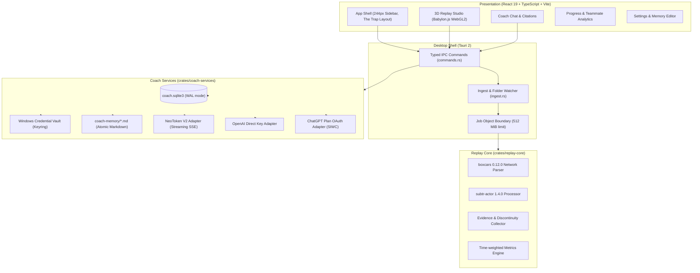

# AntiRL Architecture & Domain Contracts

Version: 1.0.0
Date: 2026-10-05

AntiRL is a Windows desktop application for Rocket League replay analysis, 3D match reconstruction, and evidence-grounded AI coaching. It is engineered with a separation of concerns across native system services, domain parsing, and presentation.

---

## 1. System Architecture

---

## 2. Security & Boundaries

1. **Local Execution**: Replay decoding, world reconstruction, metrics calculation, and spatial event detection occur 100% locally on the user's machine. Original `.replay` files are never uploaded.
2. **Worker Confinement**: The replay parser runs in an isolated subprocess wrapped in a Windows Job Object configured with:
   - `ProcessMemoryLimit = 512 MiB`
   - `ActiveProcessLimit = 1`
   - `JOB_OBJECT_LIMIT_KILL_ON_JOB_CLOSE`
3. **Protected Credentials**: API keys and OAuth tokens are stored in the Windows Credential Vault via `keyring`. Credentials are never sent over IPC to the webview, serialized into logs, or written to Markdown memory files.
4. **Memory Secret Redaction**: Before writing to `coach-memory/*.md`, the system runs a leak filter that rejects any text containing `sk-`, `Bearer `, `apiKey`, `access_token`, or `refresh_token`.
5. **Strict Content Security Policy**: The Tauri webview enforces local-only script execution with connections permitted only to verified AI endpoints (`https://api.v2.neokens.com`, `https://api.openai.com`).

---

## 3. Database Schema

SQLite runs in `WAL` journal mode with foreign keys enabled:

- `settings`: Single-row JSON configuration (`id = 1`, `body TEXT`).
- `replays`: Replay summaries and full analyses indexed by `id TEXT PRIMARY KEY` (MatchGUID or SHA-256 hash).
- `conversations`: Scoped coaching chat sessions (`id TEXT PRIMARY KEY`, `title TEXT`, `updated_at TEXT`).
- `messages`: Chat message history linked to conversations (`id TEXT PRIMARY KEY`, `conversation_id TEXT REFERENCES conversations(id)`, `body TEXT`).
- `profiles`: Multiple player profiles (`id TEXT PRIMARY KEY`, `name TEXT`, `platform TEXT`, `active BOOLEAN`, `body TEXT`).
- `goals`: Tracked coaching objectives (`id TEXT PRIMARY KEY`, `title TEXT`, `target TEXT`, `current TEXT`, `status TEXT`, `updated_at TEXT`).
